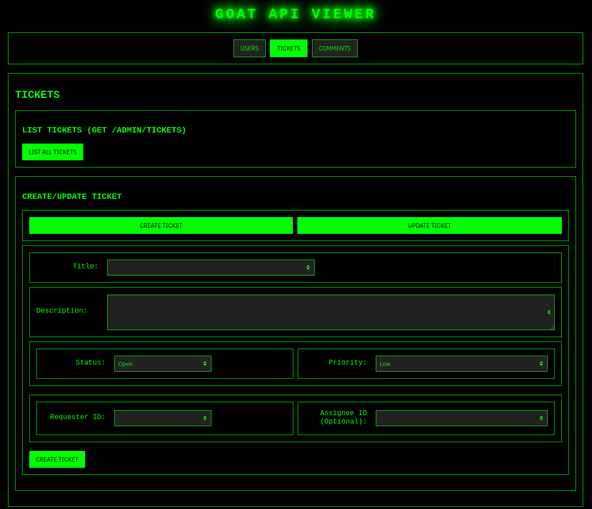

# GOAT - Greatest Of All Ticketing 🐐



🐐 is not your average ticking system. Lightweight, modular, and extensible ticketing system built with Go. 
It's designed to be a foundation for a robust and scalable customer support and issue tracking platform. 
The project is structured with a clear separation of concerns, making it easy to understand, maintain, and extend.


## Core Concepts

The system is built around the idea of providing a solid backend for a ticketing system, with a focus on a clean API and a data model that can be easily adapted to various business needs.
## Features

*   **User Management:** Basic CRUD operations for managing users.
    *   `GET /admin`: List all users.
    *   `GET /admin/role/{role}`: List users by role (e.g., Admin, Agent, Customer).
    *   `POST /admin`: Create a new user.
    *   `GET /admin/{id}`: Get a user by their ID.
    *   `PUT /admin/update/{id}`: Update a user's information.
    *   `DELETE /admin/delete/{id}`: Delete a user.
*   **Customer Management:** Basic CRUD operations for managing customers.
    *   `GET /admin/customers`: List all customers.
*   **Ticket Management:** CRUD operations for managing tickets.
    *   `GET /admin/tickets`: List all tickets.
    *   `POST /admin/tickets`: Create a new ticket.
    *   `GET /admin/tickets/{id}`: Get a ticket by its ID.
    *   `PUT /admin/tickets/{id}`: Update a ticket's information.
*   **Comment Management:** CRUD operations for managing comments.
    *   `GET /admin/comments`: List all comments.
    *   `POST /admin/comments`: Add a new comment to a ticket.

## How to Run

1.  **Prerequisites:**
    *   Go (version 1.x or higher) installed.
    *   MariaDB installed.
2.  **Clone the repository:**
    ```bash
    git clone https://github.com/mibracy/goat.git
    cd goat
    ```
2.5. **Create database db_schema.sql**

3.  **Install dependencies:**
    ```bash
    go mod tidy
    ```
4.  **Run the application:**
    ```bash
    go run main.go
    ```
    The server will start on `http://localhost:8420`.

5.  **Using the HTML Page:**
    Once the server is running, you can interact with the API using the provided HTML page.
    Open `index.html` in your web browser:
    ```bash
    open index.html # On macOS
    start index.html # On Windows
    xdg-open index.html # On Linux
    ```
    This page provides forms to test the different user endpoints.

## Docker

To build the Docker image:
```bash
docker build -t goat-app .
```

To run the Docker container:
```bash
docker run -p 8420:8420 goat-app
```

### Environment Variables for Database Connection

The application uses environment variables to connect to the database. You can set the following variables when running the application (e.g., with `docker run -e`):

*   `DB_HOST`: Database host (default: `127.0.0.1`)
*   `DB_PORT`: Database port (default: `3306`)
*   `DB_USER`: Database username (default: `casaos`)
*   `DB_PASSWORD`: Database password (default: `casaos`)
*   `DB_NAME`: Database name (default: `casaos`)

Example:
```bash
docker run -p 8420:8420 -e DB_HOST=your_database_ip -e DB_USER=your_user -e DB_PASSWORD=your_password -e DB_NAME=your_db_name goat-app
```

## Future Features

*   **Authentication and Authorization:** Secure user authentication and role-based access control.
*   **Customer Management:** Expanded CRUD for customer information.
*   **Email Notifications:** Send email notifications for ticket updates.
